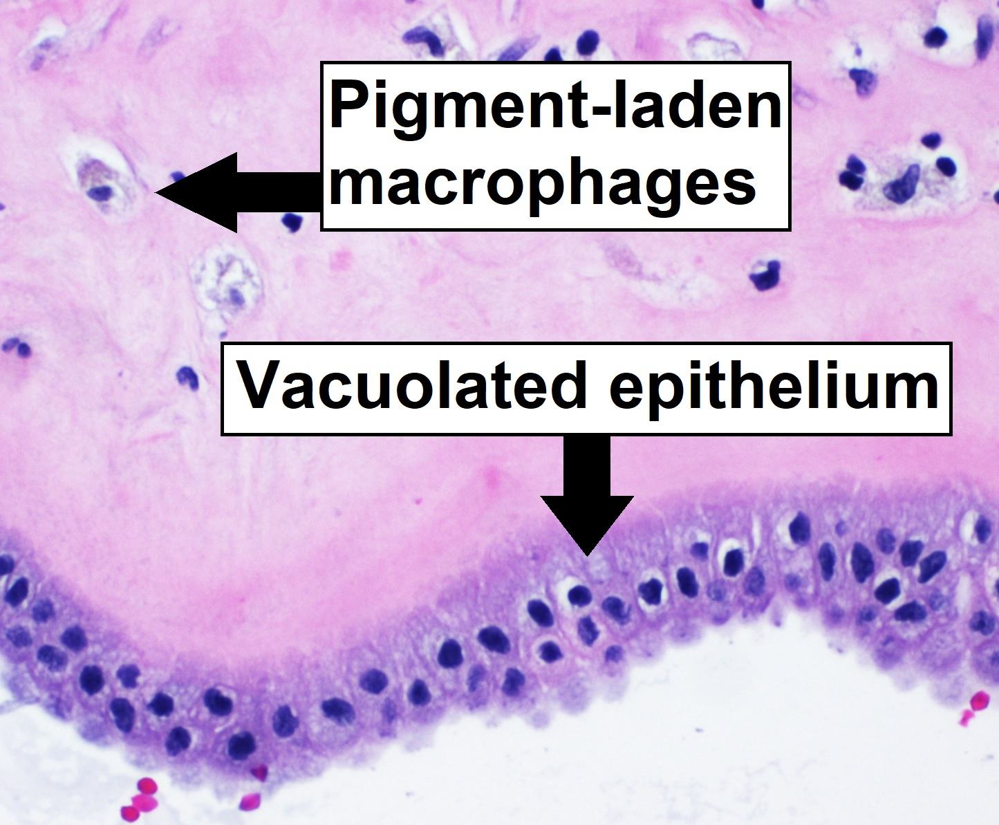

```{r echo = FALSE, eval = FALSE, message = FALSE, warning=FALSE}
version #check version of RStudio - this is relevant for packages 
```

```{r setup, include=FALSE}
```

```{r setup, include=FALSE, warning = FALSE}
knitr::opts_chunk$set(echo = TRUE)
knitr::opts_chunk$set(message = FALSE)
knitr::opts_chunk$set(warning = FALSE)
```

```{r echo = FALSE, eval = FALSE, message = FALSE, warning=FALSE}
#Clear Workspace
rm(list = ls(all.names = TRUE)) # clear all objects includes hidden objects.
gc() #frees up memory and reports the memory usage
```


```{r eval = FALSE, echo = FALSE, message = FALSE, warning=FALSE}

library(reticulate)
# path on the system chosen by default
use_python('/Users/Andr/anaconda3/bin/python')
# prints the python configuration
py_config()
```
## R Markdown

# **BMS353**

# **Bioinformatics**

**Alveolar Macrophages after Murine Lung Transplant -
(mouse)**


This is an R Markdown document. Markdown is a simple formatting syntax.

When you click the **Knit** button a document will be generated that includes both content as well as the output of any embedded R code chunks within the document. You can embed an R code chunk like this:


**INTRODUCTION**


 ```{r pressure, echo=FALSE, fig.cap="Figure 1 - Image that shows stained macrophage that is found in alveolar sac. Image is just informative but not necessarly relevant to this project", out.width = '100%'}
 
 ```

In this report we will analyze data for a research study that covers the following topic: Alveolar Macrophages after Murine Lung Transplant. For this we have the following resources provided:


*METHODS*

`````````````````````````````````````insert text from word

|Sample number | Condition |
|-------:|:------|
| `r 2+2`   | naive|
| 4 | 2h post-perfusion |
| 4 | 24 h post-perfusion |

[GSE116583](https://www.ncbi.nlm.nih.gov/geo/query/acc.cgi?acc=GSE116583)

[Google drive](https://drive.google.com/drive/folders/1AqYi0Ps5t5xo6XYWXjOtO6eDOMpT1ADE) - Google drive folder with the following content:

* meta_data
* salmon-quant.sf files
* tx2gene.csv


The project name BMS353-Alveolar-Macrophages---RNA-seq-dataset with all files and the code are available on github in a repository:

[Github](https://github.com/IoanaAndra/BMS353-Alveolar-Macrophages---RNA-seq-dataset)


In order to use the necessary functions and analyze the data, we use some packages available in R:

* readr
* ggplot2
* dplyr

Every chunk of code can be name like this:
```{r Name_of_chunk_here}

```

Installing all packages necessary for this project in R. 

```{r eval = FALSE, tidy = FALSE, message = FALSE, echo = 1:6, warning=FALSE}
#SECTION FOR PACKAGES
#installing all necessary packages
# IF using same R version (4.0.3) and have all packages installed already, all lines of this section can remain commented 
 
# install.packages("readr")
# install.packages("ggplot2") #*
# install.packages("dplyr")
# install.packages("learnr")
# install.packages("stringi")
# install.packages("tidyverse")
# install.packages("ggpubr")
# if (!requireNamespace("BiocManager", quietly = TRUE))     # installing tximport
#     install.packages("BiocManager")
# 
# BiocManager::install("tximport")

# install.packages("jsonlite")
# BiocManager::install("GenomicFeatures")

# BiocManager::install("S4Vectors")
# BiocManager::install("stats4")
# BiocManager::install("BiocGenerics")
# BiocManager::install("pheatmap")
# BiocManager::install("org.Mm.eg.db")
# BiocManager::install("genefilter")
# BiocManager::install("GEOquery")
# BiocManager::install("limma")
# BiocManager::install("biomaRt")
# BiocManager::install("clusterProfiler")
# BiocManager::install("pathview")
# BiocManager::install("fgsea")
# install.packages("reticulate")     #to integrate Python code with R code
#install.packages("DiagrammeR") #works with html output
# install.packages("stringr")

install.packages() #check installed packages. This can be seen also in Packages tab

# old.packages() 

# update.packages(ask = FALSE) #update installed packages without asking permission from user

```
*All code is visible in Rmd file.


*ANALYSIS*

**1. Import raw data (.csv and quant.sf files)* 

CSV and TSV file formats can be stored in variables and display first row of them using head()

With head, we display first rows of data tx2gene.csv and a quant.sf

tx2gene.csv is the transcripts and genes relationship table file
```{r Read tx2gene.csv, tidy = FALSE, collapse = FALSE, message = FALSE, warning=FALSE} 
library(readr)

dataPath <- "tx2gene.csv" #asigning value which represent path of file

file.exists(dataPath) #file.exists() return TRUE id file can be found or FALSE if it is not found
tx2GeneFile <- read.csv(file = 'tx2gene.csv') #file with delimiter ","
quantFile <- read_tsv(file = 'salmon_quant/SRR7457551/quant.sf') #file with delimiter "\t"
head(tx2GeneFile, n = 2)
head(quantFile, n = 3 )
#view(tx2GeneFile)
```
Name represents in quant. sf the TXNAME found in tx2gene.csv. But tx2gene.csv contains all 12 samples (in order ...51-...62)


 


Sample txt. presents the full experimental design that was followed. 12 columns for all 12 samples that are found in a salmon output format file that can be further read and accessed using read_tsv
```{r echo = FALSE, tidy = FALSE, collapse = FALSE, message = FALSE, warning=FALSE}


library(tximport)
library(readr)
library(dplyr)
# Read the sample information into R
sampleinfo <- read.delim("meta_data/sampleInfo.txt") #reads in delimited text file
View(sampleinfo)    # view sampleinfo.txt in a new tab
#glimpse(sampleinfo)
sampleinfo


rownames(sampleinfo) <- sampleinfo$run 

dirs <- list.files("salmon_quant/")
quant_files <- list.files("salmon_quant/",pattern="quant.sf",recursive = TRUE,full.names = TRUE)
#names(quant_files) <- dirs
quant_files

# tx2gene links transcript IDs to gene IDs for summarization
tx2geneVariable <- read.csv("tx2gene.csv")

txi <- tximport(files=quant_files, type="salmon", tx2gene=tx2geneVariable)

View(txi)  #view txi in a new tab

#inspect salmon output (quant.sf files)
quants <- read_tsv(quant_files[1])
head(quants)

 # spec(quants)
 
 filter(quants, quants$TPM ==0) #filter data where TPM = 0
#print.data.frame(quants) #print quants, maximum output to print in console 200 lines
 
tail(quants, n = 3)

max(quants$TPM)


 
```


After asigning to quants variable the files

```{r echo = FALSE, tidy = FALSE, collapse = FALSE, message = FALSE, warning = FALSE}
rpk <- quants$NumReads / quants$EffectiveLength
scale_factor <- sum(rpk) / 1e6
tpm <- rpk / scale_factor

#define transcript mapping

gtf_file <- "Mus_musculus.GRCm38.91.chr.gtf.gz"
file.exists(gtf_file)

download.file("ftp://ftp.ensembl.org/pub/release-91/gtf/mus_musculus/Mus_musculus.GRCm38.91.chr.gtf.gz",destfile = gtf_file) #gtf based on organism of interest

# create a database of transcripts
# Could take a few minutes to run the makeTxDbFromGFF command
library(GenomicFeatures)
txdb <- makeTxDbFromGFF(gtf_file)


#specify number of keys and columns

keytypes(txdb)
columns(txdb)

#get names for all transcripts - using keys function
#compose query - using select function - this will return data frame

k <- keys(txdb, keytype="TXNAME")
tx_map <- select(txdb, keys = k, columns="GENEID", keytype = "TXNAME")

#visualise first rows of the transcript map
head(tx_map, n = 3)
```


``` {r echo = FALSE, eval = FALSE, tidy = FALSE, message = FALSE, warning = FALSE}

#use tximport package to import raw data for each of the 12 samples

library(tximport)
tx2gene <- tx_map
# write.csv(tx2gene,file="tx2gene.csv",row.names = FALSE,quote=FALSE)
txi <- tximport(quant_files,type="salmon",tx2gene = tx2gene)

table(tx_map$TXNAME %in% quants$Name)

tx2gene <- tx_map
txi <- tximport(quant_files,type="salmon",tx2gene = tx2gene,ignoreTxVersion = TRUE)

names(txi)

head(txi$counts) 

all(rownames(sampleinfo) == colnames(txi$counts))

library(tidyr)
library(dplyr)

quants <- separate(quants, Name, c("TXNAME","Number"),remove = FALSE)
head(quants, n = 3)


quants <- left_join(quants, tx_map, by="TXNAME")
head(quants, n = 3)

tx2gene <- dplyr:::select(quants, Name, GENEID)
head(tx2gene)

any(is.na(tx2gene$GENEID))

tx2gene <- filter(tx2gene, !is.na(GENEID))

library(tximport)
txi <- tximport(quant_files,type="salmon",tx2gene = tx2gene)


```
Summarising
```{r echo = FALSE, message = FALSE, echo = FALSE, warning=FALSE}
library(readr)
library(dplyr)

head(quants)
summarise(quants, min(quants$Length), max(quants$Length), min(quants$EffectiveLength),max(quants$EffectiveLength)) #summarises in a table values that we select from object 

write.table(colnames(quants), col.names=FALSE)
```

*2. Quality assesment*

Next, testing quality assesment for the raw reads of gene transcripts that were imported with tximport.

```{r echo = FALSE, message = FALSE, echo = FALSE, warning=FALSE}
library(DESeq2)
library(S4Vectors)
library(stats4)
library(BiocGenerics)

dds <- DESeqDataSetFromTximport(txi, 
                                colData = sampleinfo,
                                design <- ~condition)


colData(dds)

tpm <- txi$abundance #asign list of TPM values to tpm variable
write.csv(tpm, file="tpm_values_abundance.csv",quote=FALSE)

dir.create("Robjects/",showWarnings = FALSE)  #to save pre-processing data
saveRDS(dds, file="Robjects/dds.rds")

```


we can count the number of reads for each sample and print in the console. This can be written in a csv file.

```{r echo = FALSE, message = FALSE, echo = FALSE, warning=FALSE}

for(i in 1:12) {
  
   print(sampleinfo$run[i])
        print(sum(assay(dds)[,i]))
        cat("\n")
}
summaryReads <- colSums(assay(dds))

write.csv(summaryReads,  file="summary_number_of_reads.csv", quote = FALSE, col.names = TRUE) # how to remove 1 and x (row 2 in excel?)
readAddHeader <-read.csv("summary_number_of_reads.csv", header =FALSE) 
colnames(readAddHeader) <- c("Sample", "rawcount")

write.csv(readAddHeader,  file="summary_number_of_reads.csv", quote = FALSE)

```
```{r echo = FALSE, message = FALSE, eval = FALSE}
colSums(assay(dds)) # same as above but different output format
```

This can be plotted into bar chart, scatterplot or boxplot

```{r message = FALSE, echo = FALSE, warning=FALSE, fig.dim= c(8,5), fig.cap = "Plotting based on csv file attempts."}

library(ggplot2)

ggplot(data=readAddHeader) + geom_bar(aes(x=readAddHeader$rawcount, fill=readAddHeader$Sample)) + geom_abline(aes(intercept=0,slope=1,color="Line description"),size=2.5,show_guide=TRUE) + guides(fill = guide_legend(override.aes = list(linetype = 0), title="[TITLE OF FILL]"), 
             color = guide_legend(title="Samples Legend")) + scale_color_manual(values="darkorchid4")

ggplot(readAddHeader, aes(x = Sample, y = rawcount)) + geom_point() + ggtitle("visualise distribution for counts")


```

```{r message = FALSE, echo = FALSE, warning=FALSE, eval = FALSE}
is_expressed <- assay(dds) >= 5
head(is_expressed)

```
```{r message = FALSE, echo = FALSE, warning=FALSE, fig.cap="Figure - Bar charts that show number of millions of reads for each of the 12 samples"}
library(dplyr)
library(ggplot2)
sampleinfo %>% mutate(MillionsOfReads = colSums(assay(dds))/1e6) %>% 
  ggplot(aes(x = sampleinfo$run, y = MillionsOfReads)) + geom_col(fill="darkgoldenrod2") + ggtitle ("Number of milliions of reads for each sample") +  labs (x = "Samples") + theme_bw() + geom_label(aes(label = sampleinfo$name))
``` 


```{r eval = FALSE, echo = 0:2}
print('Gene from row 3 expressed in this number of samples:')
sum(is_expressed[3,])

print('Gene from row 400 expressed in this number of samples:')
sum(is_expressed[400,])
```


```{r message = FALSE, echo = FALSE, warning=FALSE, fig.cap="Figure - Bar charts that frequency of reads for each of the 12 samples. Many genes are expressed in 2 samples only"}

#THIS CAUSES AN ERROR WHILE KNITTING - It works as R script file but it could be an issue with knitr package here?? Not sure
#error: error in evaluating the argument 'x' in selecting a method for function 'rowSums': object

 # hist(rowSums(is_expressed), main="Number of samples a gene is expressed in", col = "lightblue2",xlab="Sample Count", border = "darkblue", ylim = c(0,35000))
```


```{r eval = FALSE, echo = FALSE}
keep <- rowSums(assay(dds) >= 5) >= 2
table(keep) 

dds <- dds[keep,] # keep genes 
```


```{r message = FALSE, echo = FALSE, warning=FALSE, fig.cap="Figure - Distribution of counts   logarithmic"}
boxplot(assay(dds), main = "Distribution for counts", xlab = "Samples") #visualise distribution for counts
 
# can be also logarithmic 

# log2
vsd <- vst(dds,blind=TRUE)

# normalising dristibution
boxplot(assay(vsd), xlab="Samples", ylab="Log2 millions of counts",las=2,main="Normalised Distributions")
# 
abline(h=median(assay(vsd)), col="red") # add straight line to plot (linear regression)
```


```{r message = FALSE, echo = FALSE, warning=FALSE, fig.cap=" Heatmap of genes for all samples"}
sampleDists <- dist(t(assay(vsd)))

library(RColorBrewer)
library(pheatmap)
sampleDistMatrix <- as.matrix(sampleDists)
rownames(sampleDistMatrix) <- paste(colData(dds)$condition, colData(dds)$time, sep="-")
colnames(sampleDistMatrix) <- colData(dds)$name
colors <- colorRampPalette( rev(brewer.pal(9, "RdBu")) )(255)
pheatmap(sampleDistMatrix,
         col=colors, main = "Gene heatmap")

```
```{r eval = FALSE, echo = FALSE}
assay(vsd)
```


```{r message = FALSE, echo = FALSE, warning=FALSE, fig.cap=" PCA before correction, 2 samples of naive should be swapped with 2 samples of post-reperfusion"}
plotPCA(vsd,intgroup="condition") + theme_bw() + ggtitle("title")
```


```{r message = FALSE, echo = FALSE, warning=FALSE, fig.cap=" Change the PCA plot with one that shows name labels for each sample. The values entered were consistent, as the groups were split based on states (naive and post-reperfusion"}
plotPCA(vsd,intgroup="condition") + theme_bw() + geom_label(aes(label = sampleinfo$name)) + ggtitle("title") + coord_fixed(xlim = c(-40, 38))
#same as above but with labels and adjusted to see name of samples
```


```{r message = FALSE, echo = FALSE, warning=FALSE, fig.cap=" Here we can see the variance differentiated for 2h and 24h post-reperfusion"}
 plotPCA(vsd,intgroup= c("condition","time")) + theme_bw() + ggtitle("title")  

```
We need to swap N03 with R08 and N04 with R07 in order to get corrected sampleinfo txt file.
```{r}
# library(stringr)
# library(dplyr)
# sampleinfo %>% 
# mutate(condition = str_to_lower(condition)) %>% 
# mutate(time = str_trim(time)) %>% 
# mutate(condition = ifelse(name == "N03_AM_Naive","post_reperfusion",condition)) %>% 
# mutate(condition= ifelse(name == "R08_AM_Allo24h","naive",condition)) %>% 
# write.table(file="meta_data/sampleInfo_corrected.txt",sep="\t",row.names = FALSE)
# 
# sampleinfo_corrected %>% 
# mutate(condition = str_to_lower(condition)) %>% 
# mutate(time = str_trim(time)) %>% 
# mutate(condition = ifelse(name == "N04_AM_Naive","post_reperfusion",condition)) %>% 
# mutate(condition= ifelse(name == "R07_AM_Allo24h","naive",condition)) %>% 
# write.table(file="meta_data/sampleInfo_corrected.txt",sep="\t",row.names = FALSE)
```


```{r}
sampleinfo_corrected <- read_tsv("meta_data/sampleInfo_corrected.txt", show_col_types = FALSE)
dds <- DESeqDataSetFromTximport(txi, 
                                colData = sampleinfo,
                                design <- ~condition)
                                
dds

vsd <- vst(dds)
```


```{r message=FALSE, echo = FALSE, warning=FALSE, fig.cap="Change the PCA plot with one that shows name labels for each sample with corrected sampleinfo"}


plotPCA(vsd,intgroup="condition") + theme_bw() + geom_label(aes(label = sampleinfo$name)) + ggtitle("title") #same as above but with labels

 plotPCA(vsd,intgroup= c("condition","time")) + theme_bw() + ggtitle("PCA plot for corrected sample info file")  

```


```{r echo = FALSE, warning = FALSE, message = FALSE, eval = FALSE}
assay(vsd) %>% 
  data.frame %>% 
  tibble::rownames_to_column("Gene")
```
SEE IF YOU DO STATISTICS WITH vsd (above)


*3. Differential Expression*


```{r echo = FALSE, eval = FALSE}
colData(dds)

design(dds) <- ~condition
```
```{r echo = FALSE, eval = FALSE}
sf <- estimateSizeFactorsForMatrix(assay(dds))
sf
```


```{r echo = FALSE, eval = FALSE}
dds <- estimateSizeFactors(dds)
dds
```

```{r echo = FALSE, eval = FALSE}
dds <- estimateDispersions(dds)
dds
```


```{r echo = FALSE, eval = FALSE}
dds <- nbinomWaldTest(dds)
```


```{r echo = FALSE, eval = FALSE}
deseqCondition <- DESeq(dds)
```


```{r echo = FALSE, eval = FALSE}
deseqCondition #displays in console 
```


```{r echo = FALSE, eval = FALSE}
results(deseqCondition) #shows baseMean, statistc results, p values, adjusted p values etc
```
```{r}
library(dplyr)
library(tibble)
results_condition <- results(deseqCondition) %>%
  as.data.frame %>% 
  rownames_to_column("ENSEMBL GENEID")  

results_condition
```
```{r}

#sorting based on p value
arrange(results_condition, pvalue) %>%  
  head(n=5)

#sorting can be done by choosing any existing column in the file and sort after it
```

```{r}
arrange(results_condition, padj) %>%
  write.csv("naive vs post-perfusion_DESeq_all.csv")
```


```{r}
arrange(results_condition, padj) %>%
  write.csv("naive vs post-perfusion 2h and 24 h_DESeq_all.csv")
```

```{r}
library(tidyr)
assay(vsd) %>% 
  data.frame %>% 
  tibble::rownames_to_column("Gene") %>% 
  pivot_longer(-Gene) %>% 
  ggplot(aes(x = name, y = value)) + geom_boxplot(fill="lightgreen") + theme(axis.text.x.bottom = element_text(angle=90)) + theme + ggtitle("Plot")

```


```{r}
dir.create("Robjects/",showWarnings = FALSE)
saveRDS(dds, file="Robjects/dds.rds")
```


```{r}
dds_time <- dds
colData(dds)
design(dds_status) <- ~time

#TO DO
```

```{r}
dds_time <- dds
dds_status$Status <- as.factor(dds$Status)
design(dds_status) <- ~Status
de_status <- DESeq(dds_time)
results_status <- results(de_status) %>%
  as.data.frame %>% 
  rownames_to_column("ENSEMBL")  

venn_data <- data.frame(CellType = results_cellType$padj<0.05,
                        Status = results_status$padj < 0.05)
library(limma)
vennDiagram(venn_data)
```


```{r}
#second venn diagram

venn_data <- data.frame(Basal = results(de_basal)$padj < 0.05, Luminal  = results(de_luminal)$padj<0.05)

vennDiagram(venn_data)
```


```{r}
dds_basal <- dds[,which(dds$CellType == "basal")]
dds_basal$Status <- as.factor(dds_basal$Status)
design(dds_basal) <- ~Status
## perform analysis
de_basal <- DESeq(dds_basal)
```


```{r}
dds_luminal <- dds[,which(dds$CellType == "luminal")]
dds_luminal$Status <- as.factor(dds_luminal$Status)
design(dds_luminal) <- ~Status
de_luminal <- DESeq(dds_luminal)
```

```{r}
dds_mf <- dds
dds_mf$Status <- as.factor(dds_mf$Status)
design(dds_mf) <- ~condition+time
de_mf <- DESeq(dds_mf)

```

```{r}
results_mf <- results(de_mf,contrast=c("time","naive","24h"
                                       ))
results_mf
```

```{r}
dds <- estimateSizeFactors(dds) 
```


```{r}
countMatrix <-counts(dds, normalized=TRUE)
head(countMatrix)
```


```{r}
write.csv(countMatrix,file="normalized_counts.csv")
```


```{r message = FALSE, echo = FALSE, warning=FALSE, eval = FALSE}
#*****************************************************************************************
#************************Other attempts (not following the worlflow to test how plot work)
#Saving in CSV. Can be used in GOrilla?


# library(readr)
# library(dplyr)
# 
# quantFile <- read_tsv(file = 'salmon_quant/SRR7457551/quant.sf')
# write.csv(quantFile, sep=",", file = 'Salmon outputs converted into CSV/SRR7457551.csv')
# 
# tx2gene <- dplyr:::select(quants, Name, GENEID)
# head(tx2gene)
# 
# any(is.na(tx2gene$GENEID))
# 
# tx2gene <- filter(tx2gene, !is.na(GENEID))
# # write.table(quantFile, file="", quote=TRUE, sep=",", row.names=TRUE)
# ```


```
```{r message = FALSE, echo = FALSE, warning=FALSE, message = FALSE}
library(readr)
library(ggplot2)
library(data.table)

# head(quants)

quantFile_51 <- read_tsv(file = 'salmon_quant/SRR7457551/quant.sf', show_col_types = FALSE)


plotVar <- ggplot(quantFile_51, aes(x = quantFile_51$TPM, y = quantFile_51$Length)) +
  geom_point(color = "indianred4")
plotVar + theme_bw() + scale_x_continuous(trans='log10') + ggtitle ("TPM relation Gene length") +  labs (x = "Samples")

# plotVar + theme_minimal()

# mean(quants$Length) mean(quants$EffectiveLength)


# text <- paste("text for this plot", "newline", sep = " ")
# 
# text.p <- ggparagraph(text = text, face = "italic", size = 11, color = "black")
```
```{r message = FALSE, eval = FALSE, echo = FALSE, warning=FALSE}
library(readr)
library(ggplot2)
library(data.table)
library(ggpubr)

quantFile_53 <- read_tsv(file = 'salmon_quant/SRR7457553/quant.sf', show_col_types = FALSE)


plotVar2 <- ggplot(quantFile_53, aes(x = quantFile_53$TPM, y = quantFile_53$Length)) +
  geom_point(color = "green4")

plotVar2 + theme_bw() + scale_x_continuous(trans='log10')   

# adding legend

text <- paste("text for this plot", "newline", sep = " ")

text.p <- ggparagraph(text = text, face = "italic", size = 11, color = "black")
```


```{r message = FALSE, echo = FALSE, warning=FALSE}

library(ggplot2)
library(data.table)
# I can't do overlapping of ggplot2

quantFile_53 <- read_tsv(file = 'salmon_quant/SRR7457553/quant.sf') #naive sample

quantFile_51 <- read_tsv(file = 'salmon_quant/SRR7457551/quant.sf') #2hpost-perfusion sample


plotVar <- ggplot(quantFile_51, aes(x = quantFile_51$TPM, y = quantFile_51$Length)) +
  geom_point() 

# plotVar + theme_bw()

# plotVar + scale_x_continuous(trans='log10')


# geom_point() + geom_point(data, color = "red") # re-define data, overwrite top layer inheritance
```


```{r eval = FALSE, echo = FALSE, message = FALSE, warning=FALSE}


rlang::last_error() # to check last error


```


```{r}
library(org.Mm.eg.db)
```


```{r}
columns(org.Mm.eg.db)
keytypes(org.Mm.eg.db)
keys(org.Mm.eg.db, keytype="ENSEMBL")[1:10]
select(org.Mm.eg.db, keys="ENSMUSG00000027750",
       keytype = "ENSEMBL",columns=c("SYMBOL","GENENAME")
)
```
```{r}
AnnotationDbi::select(org.Mm.eg.db, keys="ENSMUSG00000000381",keytype = "ENSEMBL",columns=c("SYMBOL","GENENAME"))
```


```{r}
anno <- AnnotationDbi::select(org.Mm.eg.db,keys=results_cellType$ENSEMBL,
              columns=c("SYMBOL","GENENAME"),
              keytype="ENSEMBL")
# Have a look at the annotation
head(anno)

dim(anno)

dim(results_cellType)


dup_ids <- anno$ENSEMBL[duplicated(anno$ENSEMBL)]
filter(anno, ENSEMBL %in% dup_ids) %>% 
  arrange(ENSEMBL) %>% head
```


```{r}
anno <- AnnotationDbi::select(org.Mm.eg.db,keys=results_status$ENSEMBL,
              columns=c("ENSEMBL","SYMBOL","GENENAME","ENTREZID"),
              keytype="ENSEMBL") %>% 
  filter(!duplicated(ENSEMBL))
dim(anno)
```

```{r}
results_annotated <- left_join(results_cellType, anno,by="ENSEMBL") %>% 
  arrange(padj)
head(results_annotated)
```
```{r}
write.csv(results_annotated,file="cellType_DESeq_annotated.csv",row.names=FALSE)
saveRDS(results_annotated, file="Robjects/results_cellType_annotated.rds")
```


```{r}
library(DESeq2)
## Read the counts that we produced previously
dds <- readRDS("Robjects/dds.rds")
plotCounts(dds, "ENSMUSG00000027750",intgroup = "CellType")
```

```{r}
library(ggplot2)
results_annotated %>% 
  mutate(Significant = padj < 0.05 & abs(log2FoldChange) > 2) %>% 
  ggplot(aes(x = log2FoldChange, y = -log10(padj), col=Significant)) + geom_point()
```

```{r}
library(pheatmap)
top_genes <- results_annotated$ENSEMBL[1:10]
vsd <- vst(dds)
pheatmap(assay(vsd)[top_genes,])
```


```{r}
library(dplyr)
de_genes <- results_annotated %>% 
  filter(padj < 0.05, abs(log2FoldChange) > 1)
de_genes
```

```{r}
de_GO <- AnnotationDbi::select(org.Mm.eg.db, keys = de_genes$ENSEMBL,
                      keytype = "ENSEMBL",
                      columns = "GO")

dplyr::count(de_GO, GO) 

dplyr::count(de_GO, GO) %>% 
  arrange(desc(n))
```

```{r}
pathway_genes <- AnnotationDbi::select(org.Mm.eg.db,
                                       keys = "GO:0016020",
                                       keytype = "GO",
                                       columns="SYMBOL") %>% pull(SYMBOL)

go_table <- mutate(results_annotated, 
                   inPathway = SYMBOL %in% pathway_genes,
                   isDE = padj < 0.05 & abs(log2FoldChange) > 1)
go_table
```

```{r}
table(go_table$inPathway, go_table$isDE)

chisq.test(table(go_table$inPathway, go_table$isDE))
```

```{r}
library(fgsea)

gseaInput <- filter(results_annotated, !is.na(ENTREZID), !is.na(stat)) %>% 
  arrange(stat)
ranks <- pull(gseaInput,stat)
names(ranks) <- gseaInput$ENTREZID
```
```{r}
download.file("http://bioinf.wehi.edu.au/MSigDB/v7.1/Mm.h.all.v7.1.entrez.rds", destfile = "Robjects/Mm.h.all.v7.1.entrez.rds")
```

```{r}
Mm.H <- readRDS("Robjects/Mm.h.all.v7.1.entrez.rds")
pathways <- Mm.H
```

```{r}
library(fgsea)
fgseaRes <- fgsea(pathways, ranks, minSize=15, maxSize = 500)
dim(fgseaRes)
```

```{r}
fgseaResTidy <- fgseaRes %>%
  as_tibble() %>%
  arrange(desc(NES))

# Show in a nice table:
fgseaResTidy
```
```{r}
library(ggplot2)
ggplot(fgseaResTidy, aes(reorder(pathway, NES), NES)) +
  geom_col(aes(fill=padj<0.05)) +
  coord_flip() +
  labs(x="Pathway", y="Normalized Enrichment Score",
       title="Hallmark pathways NES from GSEA")
```
```{r}
plotEnrichment(pathways[["HALLMARK_OXIDATIVE_PHOSPHORYLATION"]],
               ranks)
```


**CONCLUSIONS**


*References*
